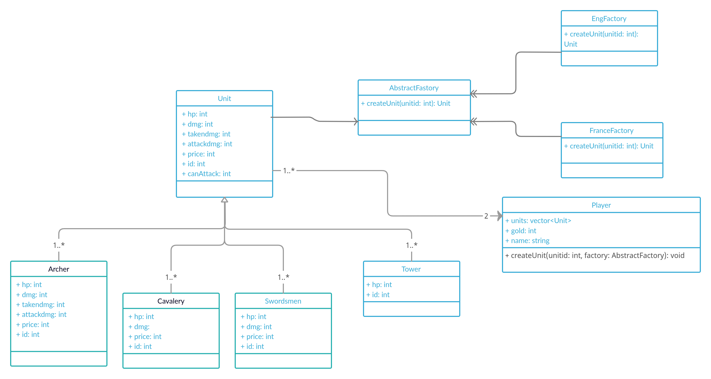

# Запуск:
### Чтобы запустить проект -  скопируйте содержимое репозитория на свой компьютер. На терминале наберите команды:
##### mkdir build
##### cd build
##### cmake ..
##### make
##### ./main

# Игровая модель:
> Два игрока, первый игрок имеет фракцию Англия, второй - Франция
Ходят по очереди, используя консоль. У каждого игрока есть фабрика, в которой можно создавать юнитов (кроме башни), у каждого юнита есть здоровье, урон и стоимость создания
За 1 ход каждый юнит может атаковать 1 раз любового юнита соперника, победит тот, кто первый уничтожит башню врага.

# Архитектура игры:
### Игра "две башни"
> Создание юнитов происходит с помощью паттерна Абстрактная фабрика. Поскольку у нас есть 2 типа наследников класса Юнит в зависимости от класса, то целесообразно использовать Абстрактную фабрику, прикрепленную к объектам класса Player с методом создания юнита, который в свою очередь, использует метод фабрики.

